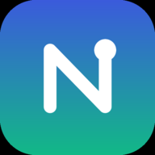

# Nexluna — محوّل الوحدات العربي المجاني | Arabic Unit Converter

<p align="center">
  
</p>

<p align="center">
  <a href="https://nexluna.netlify.app/"></a>
  
  
  
  
  
  
</p>

> **Nexluna** is a free, fast, privacy-friendly **Arabic-first (RTL) unit converter** covering **14 measurement categories** — length, weight, area, volume, temperature, digital data, speed, time, pressure, energy, power, angle, fuel economy, and frequency. 100% static (HTML/CSS/JS), installable as a PWA, works offline, and is optimized for both search engines (SEO) and AI agents (WebMCP, llms.txt, Agent Skills, Markdown negotiation).

> **بالعربية:** موقع **Nexluna** أداة ويب عربية مجانية وسريعة لتحويل **وحدات القياس** بدقة عالية عبر **14 فئة** (الطول، الوزن، المساحة، الحجم، درجة الحرارة، البيانات الرقمية، السرعة، الوقت، الضغط، الطاقة، القدرة، الزوايا، استهلاك الوقود، والتردد). يعمل بلا اتصال بعد أول زيارة، بدون تتبّع لمدخلات المستخدم.

🔗 **Live / الموقع المباشر:** <https://nexluna.netlify.app/>

**Keywords / كلمات مفتاحية:** arabic unit converter, محول وحدات, محول وحدات القياس, تحويل وحدات, unit conversion, metric to imperial, converter, RTL, PWA, cm to inch, kg to lb, celsius to fahrenheit, GB to MB, km to miles, WebMCP, llms.txt, agent-ready, static site, Netlify.

---

## ✨ الميزات | Features

- **14 فئة تحويل | 14 categories** — length, weight, area, volume, temperature, data, speed, time, pressure, energy, power, angle, fuel, frequency — بمعاملات رسمية دقيقة.
- **نتائج فورية | Instant results** أثناء الكتابة بدقة تصل إلى 6 خانات عشرية، مع رسم متحرّك للعدّاد.
- **دعم عربي كامل (RTL) | Full Arabic RTL** مع خطوط Tajawal + Cairo مستضافة ذاتيًا.
- **تطبيق ويب تقدّمي (PWA) | Installable PWA** يعمل دون اتصال بعد أول زيارة (Service Worker).
- **تحسين محركات البحث (SEO)** — عناوين ووصف فريد لكل صفحة، خريطة موقع، بيانات منظّمة JSON-LD (WebSite / Organization / WebApplication / FAQPage / BreadcrumbList), Open Graph, وروابط canonical.
- **جاهزية الوكلاء (AI Agent-Ready)** — `robots.txt` + Content-Signal، `llms.txt`، RFC 9727 API catalog، **WebMCP** (أداة `convert_units`)، **Agent Skills index**، و**Markdown negotiation** (`Accept: text/markdown`).
- **إتاحة (Accessibility)** — WCAG 2.1 AA: تباين، تنقّل بلوحة المفاتيح، ARIA، مناطق لمس ≥44px، ودعم `prefers-reduced-motion`.
- **الوضع الليلي | Dark mode** تلقائيًا حسب النظام مع تبديل يدوي.
- **أداء عالٍ | Performance** — أصول خفيفة، تحميل خطوط غير معطِّل، تأجيل الإعلانات حتى الخمول، وتخزين مؤقت طويل الأمد.

## 🤖 موارد الوكلاء | AI Agent resources

| المورد | المسار |
| --- | --- |
| llms.txt (خريطة الموقع للنماذج) | `/llms.txt` |
| API catalog (RFC 9727) | `/.well-known/api-catalog` |
| Agent Skills index (RFC v0.2.0) | `/.well-known/agent-skills/index.json` |
| WebMCP tool | `navigator.modelContext` → `convert_units`, `list_units` |
| Markdown pages | `/md/…` أو أي صفحة مع `Accept: text/markdown` |

## 🗂️ هيكل المشروع | Project structure

```
.
├── index.html                 # الصفحة الرئيسية + المحوّل متعدد الفئات (14 فئة)
├── converters/                # صفحة مخصّصة لكل فئة تحويل
├── convert/                   # صفحات التحويلات الشائعة (km→mi، kg→lb، …)
├── blog/                      # المدوّنة والمقالات
├── md/                        # نسخ Markdown للوكلاء (Markdown-for-Agents)
├── .well-known/               # api-catalog + agent-skills/index.json
├── netlify/edge-functions/    # مفاوضة Markdown (Accept: text/markdown)
├── about.html contact.html privacy.html 404.html offline.html
├── assets/
│   ├── css/style.css          # نظام التصميم
│   ├── js/converter.js        # محرّك التحويل (يستهلك البيانات المولدة)
│   ├── js/units.generated.js  # ملف متصفح مولد من data/units.json
│   ├── js/webmcp.js           # تسجيل أدوات WebMCP للوكلاء
│   ├── js/smartsearch.js      # بحث لغة طبيعية
│   └── js/main.js             # سلوك الواجهة (القائمة، الوضع الليلي، PWA)
├── manifest.webmanifest  sw.js
├── sitemap.xml robots.txt llms.txt
├── data/units.json            # المصدر canonical لتعريفات الوحدات
├── scripts/generate_units.py  # التحقق والتوليد من المصدر canonical
├── netlify.toml               # النشر، الأمان، الترويسات، Edge Functions
└── build_*.py                 # مولّدات الصفحات الثابتة
```

## 🛠️ التطوير المحلي | Local development

```bash
python3 -m http.server 8080     # ثم افتح http://localhost:8080
```

إعادة توليد كل الصفحات والملفات بعد أي تعديل في سكربتات البناء (بالترتيب):

```bash
python3 scripts/generate_units.py
python3 build_pages.py && python3 build_home.py && python3 build_content.py \
  && python3 build_blog.py && python3 build_pairs.py && python3 build_sitemap.py \
  && python3 build_llms.py && python3 build_md.py && python3 build_skills.py
```

قبل الالتزام بالتغييرات، شغّل بوابات الدقة والبحث الطبيعي:

```bash
python3 scripts/generate_units.py --check
node test_smartsearch.js
python3 test_conversions.py
```

## 🚀 النشر | Deployment

يُنشر الموقع تلقائيًا على **Netlify** من الفرع `main`. الإعدادات في `netlify.toml`
(مجلد النشر، ترويسات الأمان، Edge Functions، والتحويلات). لا توجد أسرار في المستودع.

## 🏷️ GitHub topics المقترحة

لتحسين ظهور المستودع في بحث GitHub، أضِف هذه المواضيع (Settings → Topics أو ⚙️ بجوار About):

```
arabic  unit-converter  converter  rtl  pwa  static-site  html-css-javascript
seo  netlify  webmcp  ai-agents  llms-txt  agent-ready  measurement  arabic-website
```

**الوصف المقترح (About → Description):**
> محوّل وحدات عربي مجاني وسريع — 14 فئة تحويل، PWA، يعمل بلا اتصال، ومهيّأ لمحركات البحث والوكلاء (WebMCP). Free Arabic-first unit converter (14 categories), PWA, SEO & AI-agent ready.

**رابط الموقع (About → Website):** `https://nexluna.netlify.app/`

## 👨‍💻 المطوّر | Developer

طُوِّر وصُمِّم بواسطة **محمد خيري** (Mohamed Khairy) — مهندس **MERN Stack & AI**.

- 🌐 [mokhairy.netlify.app](https://mokhairy.netlify.app/)
- 💼 [LinkedIn](https://www.linkedin.com/in/mohamed-khairy-5i/)
- 🐙 [GitHub](https://github.com/mohamed-khairy-5i)
- ✉️ [mohamedkhairy0887@gmail.com](mailto:mohamedkhairy0887@gmail.com)

## 📄 الترخيص | License

MIT © محمد خيري (Mohamed Khairy) — [mokhairy.netlify.app](https://mokhairy.netlify.app/)

راجع [`AUTHORS`](./AUTHORS) لتفاصيل المساهمين.
